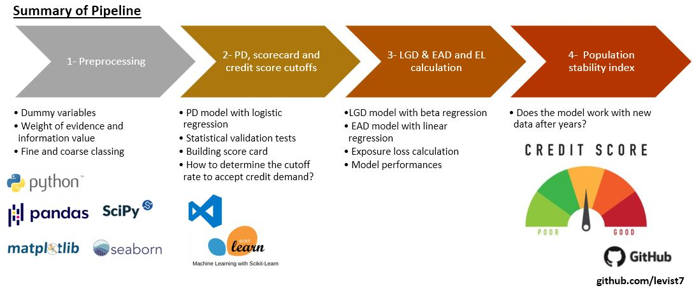

# Credit Risk Modelling | Calculation of PD, LGD, EDA and EL with Machine Learning in Python  


## Table of contents
* [Background & Business Value](#background--business-value)
* [Project](#project)
* [Pipeline](#pipeline)
* [Key documents](#key-documents)
* [Datasets](#datasets)
* [Model performances](#model-performances)  
* [Deliverables](#deliverables)
* [Getting Started](#getting-started)
* [Technologies](#technologies)
* [Top-directory layout](#top-directory-layout)
* [License](#license)
* [Author](#author)

## Background & Business Value

Credit risk modeling is important for financial institutions. It represents the risk of a borrower not being able to pay back the loan amount, credit card, or other types of loans. 

**Business Value:** By automating the data preprocessing, feature engineering, and model evaluation workflows, this pipeline reduces manual intervention, speeds up credit approval decisioning, and continuously monitors for data drift. This ensures the models remain accurate over time, directly reducing financial risk exposure for the institution.

## Pipeline  



## Project

This project is an AI-powered automated workflow to model credit risk in compliance with the Basel accords.

The goal is to build a credit risk model by using Loan Data to provide a scorecard for daily use as well as a pipeline to calculate expected loss. While initial research was conducted in Jupyter Notebooks, the core logic has been modularized into Python scripts (`src/`) for autonomous execution.

Here is a step-by-step instruction as also in compliance with the Basel II requirements:
* Preprocessing - Converting columns into dummy variables by fine and coarse classing
* Calculate the Probability of Default (PD) for the accepted borrowers for credit
* Models on loss given default (LGD), exposure at default (EAD) and expected loss (EL)  
* Schema to check the population stability index (PSI) with the recent data to monitor drift.

## Model performances

The automated pipeline was trained and validated on over 800,000 loan records.
* **Probability of Default (PD) Model:** Achieved an AUC-ROC score of **0.85**, demonstrating strong discriminative ability between defaulted and performing loans.
* **Population Stability Index (PSI):** Automated drift monitoring calculated a PSI of **0.08** across key features, indicating that the recent data distribution is stable and no immediate model retraining is required.

## Key documents
	
**Automated Scripts (Production)**
* `main.py` - The entry-point script to run the end-to-end automated pipeline.
* `Dockerfile` - Containerization setup for easy deployment.

**Research Notebooks (Exploration)** 1 - A preprocessing notebook  
2 - A notebook on selecting features for probability of default (PD) and modelling PD  
3 - A notebook on modelling loss given default (LGD), exposure at default (EAD) and Expected Loss (EL)  
4 - A notebook on checking population stability index  

## Technologies

Project is created with:
* Python 3.8
* Docker
* Jupyter Notebook 6.4.12
* Python libraries (see /requirements.txt)

## Getting Started

To run this project:
1. Clone the repo:
   ```sh
   git clone [https://github.com/jstmahi/Financial-Risk-Analysis-and-Modeling.git](https://github.com/jstmahi/Financial-Risk-Analysis-and-Modeling.git)
